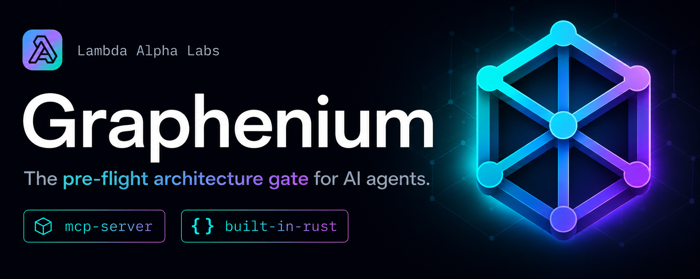

  

Lambda Alpha Labs builds trust infrastructure for AI-native software engineering.

Our flagship product is **Graphenium**, the trust and verification layer for AI-generated code changes. Graphenium maps real codebases so coding agents can plan changes, inspect blast radius, and verify edits before they land.

## Graphenium

- **Graphenium Core**: open-source local repository intelligence engine
- **Graphenium Gate**: PR and CI verification for AI-generated code changes
- **Graphenium Enterprise**: policy, auditability, and verification workflows across repositories

### Start here

| Resource | Access Link | Description |
| :--- | :--- | :--- |
| 🖥️ **Core Engine** | [Graphenium Repository](https://github.com/lambda-alpha-labs/Graphenium) | Open-source local repository intelligence engine |
| 🌐 **Production Hub** | [graphenium.dev Website](https://graphenium.dev) | Official landing page, documentation, and product tiers |
